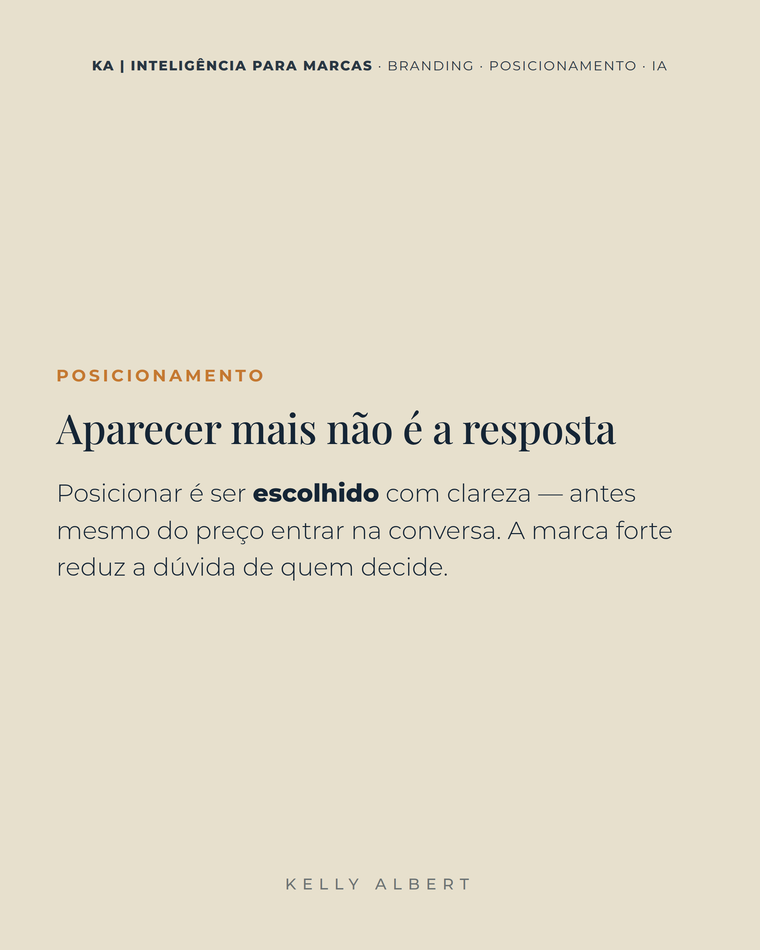
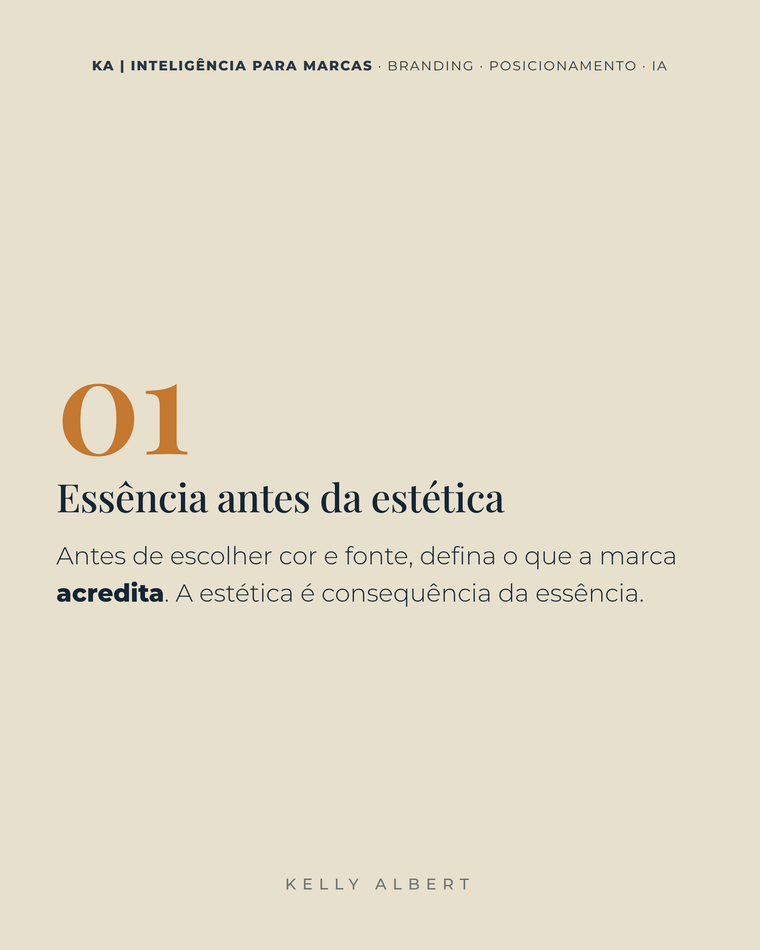
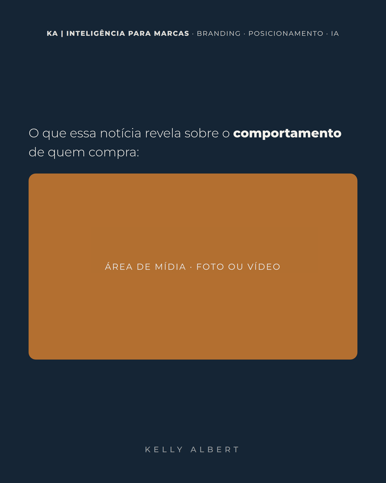
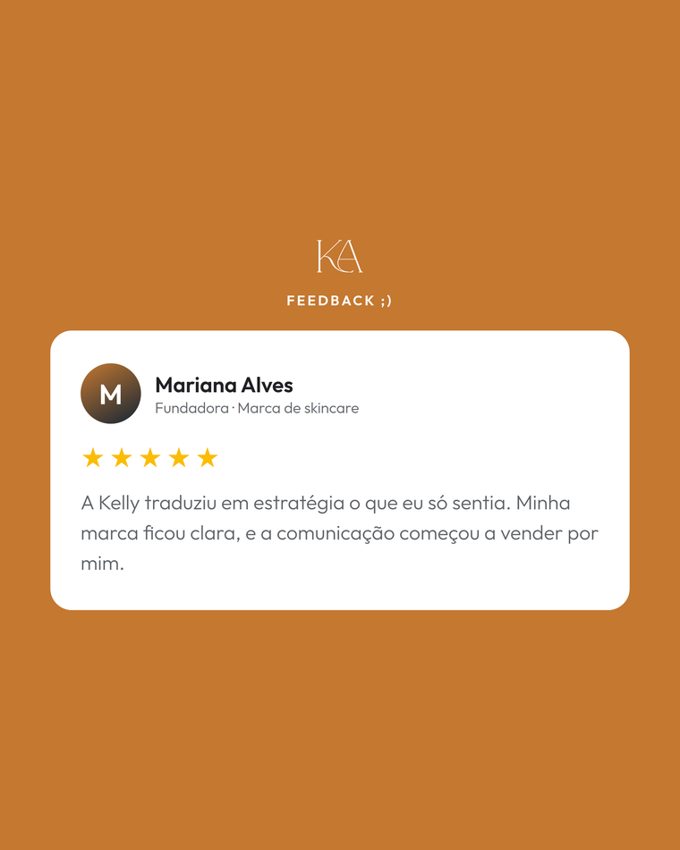

# KA — Cards / Templates

> Os 7 templates da KA. Definição: `src/templates/registry.ts` (ids `ka-*`).
> Render: `src/templates/ka/KaCards.tsx`. Estilos: `ka.css`.
> Todos no Feed 4:5 (1080×1350), com cabeçalho e rodapé da marca (exceto o
> Feedback). São os **blocos dos carrosséis de 10 cards** da KA.

---

> As miniaturas abaixo são **exemplos renderizados** com a fonte, a moldura e as
> cores reais da marca (feitos só para ilustrar cada template).

## 1. `ka-capa` — Capa (gancho)

Abertura do carrossel. Título grande em **Playfair** (≈106px) com a palavra-chave
em negrito. É o card que "fisga".
 

## 2. `ka-texto` — Texto (desenvolvimento)

Slide de conteúdo: **título opcional** + **corpo** em Montserrat. O corpo do
carrossel — argumentação, explicação, reflexão.
 

## 3. `ka-passo` — Passo numerado

**Número grande** (na cor de destaque **Caramelo**) acima do texto. Para listas
de passos/etapas dentro do carrossel.
 

## 4. `ka-midia` — Mídia (notícias e análises)

Texto + **área de mídia** (foto **ou vídeo**) em proporção fixa:
- 16:9 e 1:1 → mídia **abaixo** do texto;
- 9:16 → **texto à esquerda, mídia à direita**.
Slider "Tamanho da foto" (`midia_area`). Aceita **vídeo com áudio** (exporta PNG,
moldura para CapCut e MP4). Ideal para comentar notícias/casos.
 

## 5. `ka-comentario` — Comentário (box de print)

Texto + **box branco de comentário** (@usuário + fala) — simula o print de um
comentário real como prova social/gancho.
 

## 6. `ka-cta` — CTA (card 10)

**Fecha todo carrossel KA.** Fundo **bege travado**, frase + nome do produto
grande + **botão pill** "Link na minha bio" com contorno **caramelo**.
 

## 7. `ka-feedback` — Card de Feedback (review)

Prova social estilo **review do Google**: logo KA em PNG (branco/preto conforme
o fundo), rótulo "FEEDBACK ;)" editável, **box branco** (radius 34) com avatar em
gradiente caramelo→marinho (inicial do nome), nome + subtítulo, **estrelas** no
dourado do Google `#FBBC04` e depoimento cinza `#5F6368`. Fonte **Outfit**.
**Não usa** a moldura dos carrosséis (sem cabeçalho-fita; rodapé próprio).
Depoimento sempre **real**, sem data.
 

---

## Como montar um carrossel
Estúdio → cliente **KA** → **Montar carrossel** (até 10 slides, misturando os
templates acima; o card 10 é o CTA). Rota pública da marca: **`/ver/ka`**.
