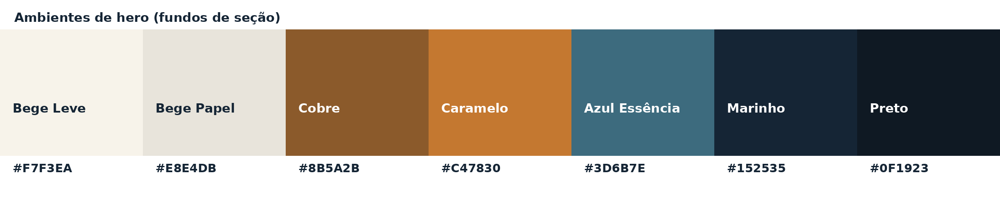
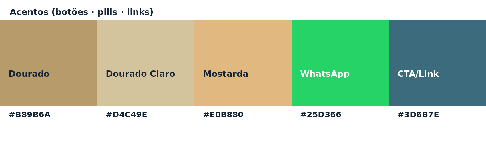

# KA — Padrão do site (kellyalbert.com.br)

> O site institucional da KA é **estático** (HTML + um único `css/style.css`),
> hospedado na Netlify (também `kellyalbert.netlify.app`). O código vive no
> repositório **`kellyalbertkabrand/kellyalbert-site`** — **não** neste repo do
> app. A fonte de verdade completa (com tom de voz, produtos, cases e template
> de e-mail) é o arquivo **`KA-Identidade-Visual-Completa.md`** lá no repo do site.
>
> Este arquivo resume o **padrão visual** do site para manter o app e o site na
> mesma identidade.

---

## 1. A mesma marca, um sistema diferente dos cards

O site compartilha a base da KA (Playfair + Montserrat, paleta quente,
assinatura Kelly Albert), mas é um **layout de página**, não um card de
carrossel. As diferenças que importam:

| | Cards (carrossel) | Site |
| --- | --- | --- |
| Cor de realce | **Caramelo** `#C47830` | **Dourado** `#B89B6A` (botão) + **Azul Essência** `#3D6B7E` (links/CTA) |
| Fundo base | fundo cheio por card | **bege claro** com textura de **grade 32px** sutil |
| Estrutura | cabeçalho-fita + rodapé | **nav fixo** + heros + seções + footer |
| Tipos | Playfair + Montserrat + Outfit | Playfair + Montserrat + **Outfit** (só preços) |

---

## 2. Cores

### 2.1 Ambientes (fundos de hero/seção — **nunca** como acento)

Cada página/produto tem uma cor-assinatura de hero:

| Página / produto | Ambiente |
| --- | --- |
| Home · /direcao · /cases · /mentoria | **Azul Marinho** `#152535` |
| /sobre · footer | **Preto** `#0F1923` |
| /livro | **Caramelo** `#C47830` |
| /programa | **Cobre** `#8B5A2B` |
| Mentoria (card) | **Azul Essência** `#3D6B7E` |
| Seções de conteúdo | **Bege Leve** `#F7F3EA` / **Bege Papel** `#E8E4DB` |

O `body` tem um fundo bege (`#F8F7F2`) com uma **grade de 32px** quase invisível
(linhas a 4% de preto) — a "textura de papel" do site.

### 2.2 Acentos (botões · pills · links — **nunca** fundo de seção)

- **Dourado** `#B89B6A` — botão CTA principal ("Fazer Diagnóstico Gratuito").
- **Dourado Claro** `#D4C49E` — palavras grifadas em fundo escuro.
- **Mostarda** `#E0B880` — botões/realces sobre cobre/marinho.
- **Verde WhatsApp** `#25D366` — botão "Falar no WhatsApp".
- **Azul Essência** `#3D6B7E` (`--cta`) — cor dos **links**, hover, nav-CTA e
  detalhes interativos.

> Tokens reais em `css/style.css` (`:root`): `--cta:#3D6B7E`,
> `--dourado:#B89B6A`, `--bg-1:#f8f7f2`, `--t-900:#0F1923` etc.

---

## 3. Tipografia

Mesmas famílias da marca, importadas do Google Fonts:

- **Playfair Display** (`--heading`) — H1/H2/H3, quotes, números de etapa.
- **Montserrat** (`--body`) — corpo, botões, menu, labels, formulários.
- **Outfit** — **só** valores monetários em destaque (ex.: R$ 117).

Regras: **sem sublinhado**, sem marcador dourado sob palavras (destaque é só
cor + peso 700), `©` sempre na cor da palavra anterior, itálico só em nomes de
método / quotes / subtítulos de case.

---

## 4. Botões (pílula)

Todos são **pílula** (`border-radius:100px`), **maiúsculas**, `letter-spacing`,
peso 700, sombra sutil e `translateY(-2px)` no hover.

| Classe | Fundo | Uso |
| --- | --- | --- |
| `.btn--diag` | Dourado `#B89B6A` (com **pulso**) | CTA principal — "Fazer Diagnóstico Gratuito" |
| `.btn--whatsapp` | Verde `#25D366` | "Falar no WhatsApp" (ao lado do diag) |
| `.btn--cta` | Azul Essência `#3D6B7E` | ações secundárias / nav |
| `.btn--dark` | Preto `#0F1923` | sobre fundo claro |
| `.btn--outline` | transparente + borda | terciário |
| `.btn--ghost` | texto azul, sem fundo | link-botão discreto |

Proibições: nunca verde sobre verde, nunca dourado sobre bege/dourado, nunca
dois CTAs primários juntos (é sempre **Diagnóstico + WhatsApp**), nunca botão
retangular ou sem maiúsculas.

---

## 5. Anatomia de uma seção

O site repete o mesmo esqueleto:

1. **Label pill** em maiúsculas (ex.: `ECOSSISTEMA KA`).
2. **H2** em Playfair com a palavra-chave em dourado (peso 700, sem marcador).
3. **Linha decorativa** centralizada (traço → ponto dourado → traço).
4. **Parágrafo de apoio** (1–3 linhas, opcional).
5. **Conteúdo** (cards / grid / imagem / quote / CTA).

Espaçamento generoso: **5–7rem** em seções, **8–11rem** em heros. Container
`max-width` ~1120–1200px. Nav de **76px**, fundo **Papel** `#F8F7F2`, links
pequenos em maiúsculas + CTA em pílula.

---

## 6. Copy-âncora do site

- Hero da home: **"Sua Essência determina o valor da sua marca."**
- Manifesto: *"Essência sem direção se dispersa. Direção sem essência se esvazia."*
- CTA recorrente: **"Sua marca tem Potência. Vamos revelar."**
- Botões-padrão: "Fazer Diagnóstico Gratuito" · "Falar no WhatsApp" ·
  "Ver Case Completo" · "Quero Meu Livro" · "Garantir Minha Vaga".
- Footer: `Kelly Albert® 2026 · CNPJ 15.096.943/0001-37`.

---

## 7. Onde mexer

| Quero mudar… | Arquivo (repo `kellyalbert-site`) |
| --- | --- |
| Cores / tokens | `css/style.css` (bloco `:root`) |
| Botões, cards, heros, nav | `css/style.css` |
| Conteúdo de uma página | `<pasta>/index.html` (ex.: `livro/index.html`) |
| Componentes reutilizáveis | `_components/` (nav, footer, CTA, seções) |
| Guia completo (tom de voz, produtos, e-mail) | `KA-Identidade-Visual-Completa.md` |
